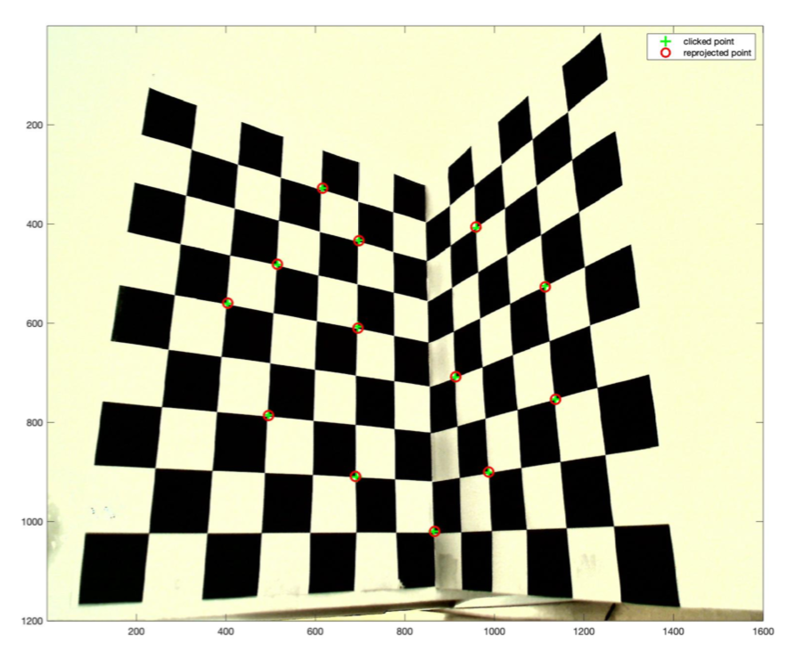
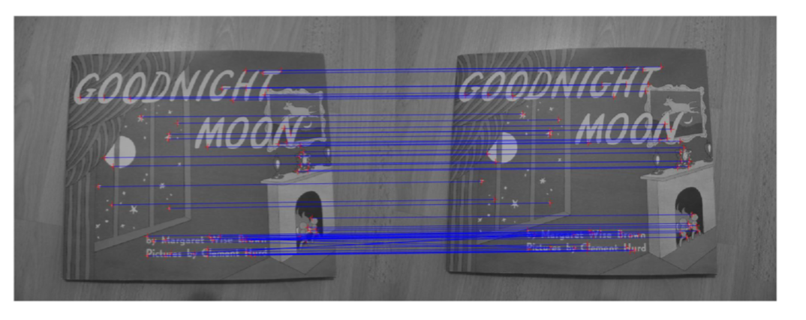
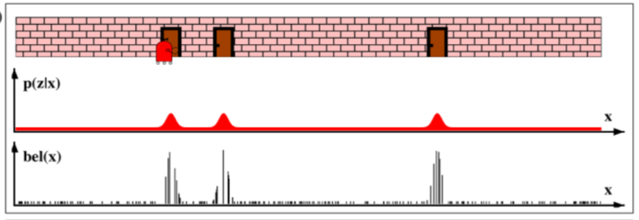
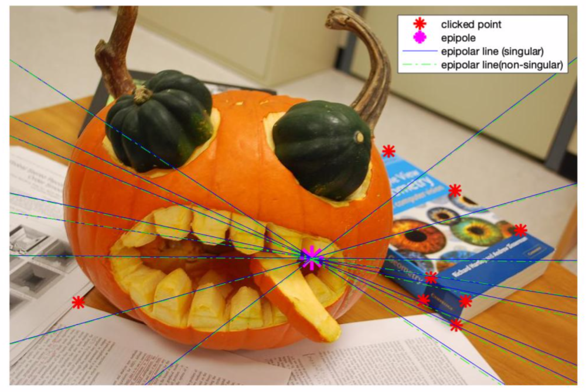
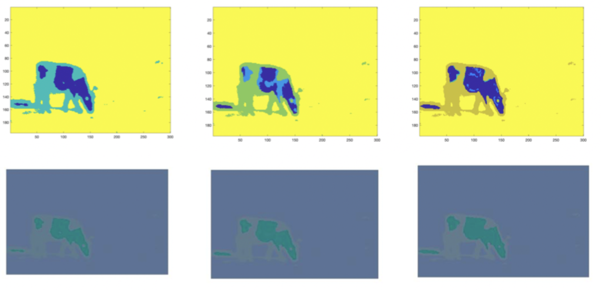
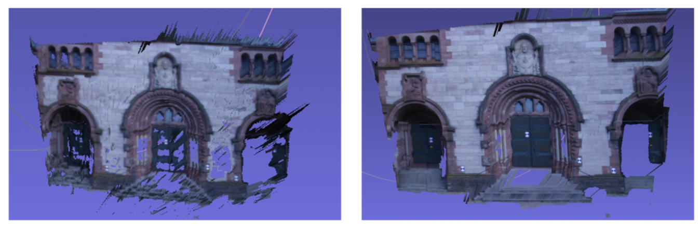
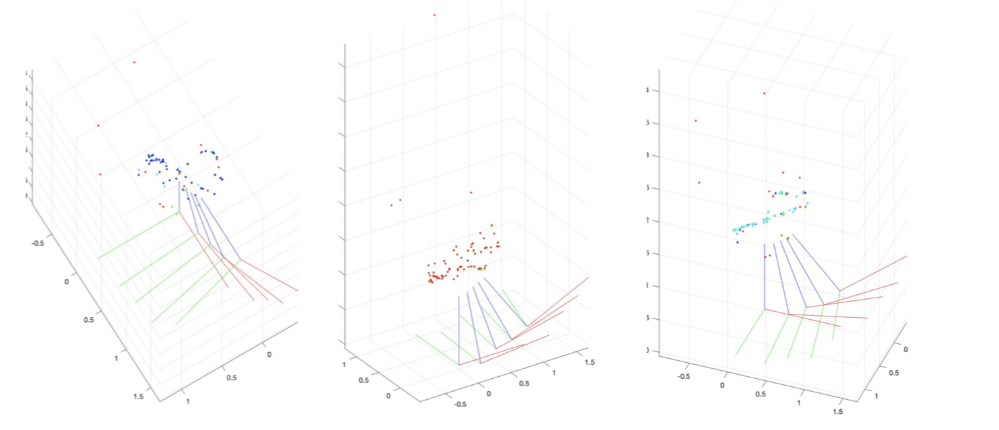
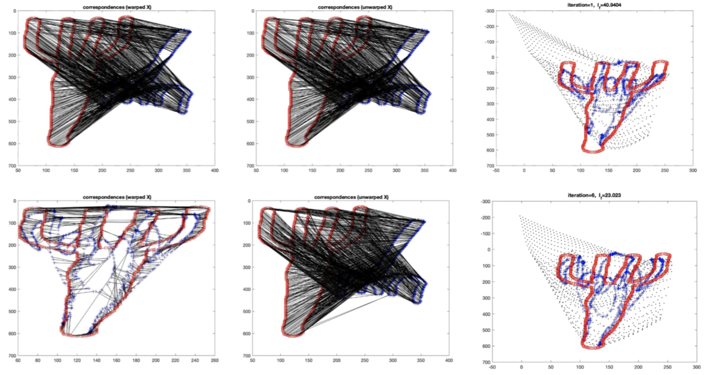
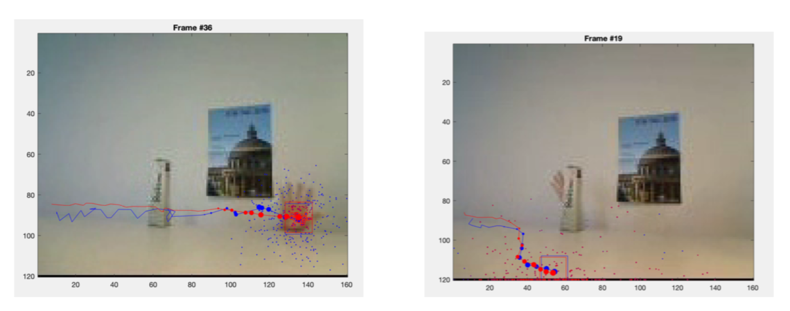
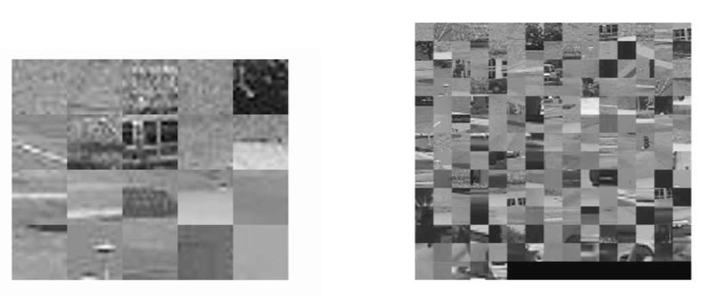

# ETH-Computer-Vision
[Computer Vision](https://cvg.ethz.ch/teaching/compvis/) course assignments in 2020 Fall @ ETH Zurich
> Correctness is NOT guaranteed but overall grade is > 95%

## as1 - Camera calibration
Direct Linear Transform, Gold Standard algorithm  

 
## as2 - Local features
Harris detector, local descriptor  

 
## as3 - Object tracking
particle filter  

 
## as4 - Model fitting
RANSAC (normal and adaptive), fundamental matrix estimation  

 
## as5 - Image segmentation
EM, mean shift  

 
## as6 - Stereo matching
winner-takes-all, graph-cut  

 
## as7 - Structure-from-Motion
simple SfM, only 5 images  

 
## as8 - Shape context
shape context descriptor, shape matching  

 
## as9 - Object tracking
condensation tracker  

 
## as10 - Image catrgorization
codebook construction, bag-of-word representation, Nearest Neighbor classifier, Bayesian classifier  

***
